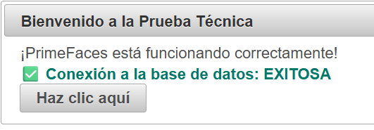

# Prueba Técnica - Proyecto Base

Este proyecto sirve como base para la prueba técnica. Aquí se detallan todos los requisitos y pasos para que cualquier persona pueda configurar el ambiente local desde cero y comenzar con el desarrollo sin contratiempos.

---

## ✅ Requisitos del Sistema

1. **Java SE 8 (JDK 8)**  
   - Descarga e instala JDK 8 desde:  
     [https://www.azul.com/downloads/?version=java-8-lts#zulu](https://www.oracle.com/java/technologies/javase/javase8-archive-downloads.html)
   - Verifica la instalación con:
     ```bash
     java -version
     ```

2. **Eclipse IDE for Enterprise Java and Web Developers**  
   - Descarga desde:  
     [https://www.eclipse.org/downloads/packages/](https://www.eclipse.org/downloads/packages/)
   - Requiere los siguientes plugins:
     - **JBoss AS, WildFly & EAP Server Tools**
     - **Maven Integration for Eclipse (m2e)**

3. **JBoss EAP 7.4**  
   - Descarga JBoss EAP (requiere cuenta):  
     [https://developers.redhat.com/products/eap/download](https://developers.redhat.com/products/eap/download)
   - **Instálalo en una ruta sin espacios ni permisos de administrador** (ej. `C:\jboss-eap-7.4\`).

4. **Oracle Database 11g Express Edition (XE)**  
   - Descarga desde:  
     [https://www.oracle.com/database/technologies/xe-prior-release-downloads.html](https://www.oracle.com/database/technologies/appdev/xe.html)
   - Crea un usuario y una base de datos que usará el proyecto.

## 🛠️ Tecnologías Utilizadas

El proyecto utiliza las siguientes tecnologías y frameworks:

1. **Java EE 8**
   - Java SE 8 como base del desarrollo
   - Maven como gestor de dependencias

2. **Frameworks y Bibliotecas**
   - **JSF (Mojarra) 2.3.14**: Framework para desarrollo de interfaces web
   - **PrimeFaces 6.1**: Biblioteca de componentes UI para JSF
   - **Hibernate 5.4.32.Final**: ORM para persistencia de datos
   - **JUnit 3.8.1**: Framework para pruebas unitarias
   - **Log4j 1.2.17**: Framework para logging

3. **Base de Datos**
   - **Oracle Database 11g XE**: Motor de base de datos
   - **Oracle JDBC Driver (ojdbc8)**: Conector para Oracle
   - **H2 (Opcional)**: Conector para H2

4. **Servidor de Aplicaciones**
   - JBoss EAP 7.4

---

## ⚙️ Configuración del Ambiente

### 1. Clonar el repositorio

```bash
git clone https://github.com/XilioDevUser/prueba-tecnica.git
```

### 2. Importar el proyecto en Eclipse

- Abre Eclipse
- Ve a: `File > Import > Maven > Existing Maven Projects`
- Selecciona la carpeta del proyecto clonado
- Eclipse descargará automáticamente las dependencias

### 3. Configurar el servidor JBoss/WildFly en Eclipse

- Ve a la vista **Servers** en Eclipse
- Clic derecho > **New > Server**
- Selecciona **JBoss EAP 7.4**
- Apunta a la carpeta donde instalaste JBoss (ejemplo: `C:\jboss-eap-7.4`)
- Agrega el proyecto `prueba-tecnica` al servidor configurado

### 4. Instalar Oracle 11g localmente

- Instala Oracle 11g (puede ser Oracle XE para desarrollo)
- Verifica que el servicio esté corriendo localmente
- Crea un usuario con una base de datos y privilegios suficientes

### 5. Configurar conexión a la base de datos

El proyecto incluye la configuración base de la base de datos en `src/main/resources/META-INF/persistence.xml`. Solo necesitas:

1. Ejecutar el script SQL para crear la tabla y secuencia:
   ```sql
   CREATE TABLE TASKS (
       ID NUMBER PRIMARY KEY,
       TITLE VARCHAR2(100) NOT NULL,
       DESCRIPTION VARCHAR2(500),
       DUE_DATE DATE,
       COMPLETED NUMBER(1) DEFAULT 0,
       CREATED_AT TIMESTAMP DEFAULT SYSTIMESTAMP
   );
   
   CREATE SEQUENCE TASKS_SEQ START WITH 1 INCREMENT BY 1;
   ```

2. Verificar que las credenciales en `persistence.xml` coincidan con tu instalación de Oracle:
   ```xml
   <property name="javax.persistence.jdbc.url" value="jdbc:oracle:thin:@localhost:1521:XE"/>
   <property name="javax.persistence.jdbc.user" value="system"/>
   <property name="javax.persistence.jdbc.password" value="oracle"/>
   ```

#### ⚡ Alternativa: Usar H2 Database (opcional)
Si tienes problemas con Oracle, puedes usar H2 (base de datos en memoria) para pruebas y desarrollo rápido.

1. Agrega la siguiente dependencia en tu `pom.xml`:
   ```xml
   <dependency>
       <groupId>com.h2database</groupId>
       <artifactId>h2</artifactId>
       <version>2.2.224</version>
       <scope>runtime</scope>
   </dependency>
   ```

2. Cambia la configuración en `persistence.xml` por la de H2:
   ```xml
   <property name="javax.persistence.jdbc.url" value="jdbc:h2:mem:test;DB_CLOSE_DELAY=-1"/>
   <property name="javax.persistence.jdbc.user" value="sa"/>
   <property name="javax.persistence.jdbc.password" value=""/>
   <property name="javax.persistence.jdbc.driver" value="org.h2.Driver"/>
   <property name="hibernate.dialect" value="org.hibernate.dialect.H2Dialect"/>
   <property name="hibernate.hbm2ddl.auto" value="update"/>
   ```

3. No necesitas instalar nada adicional, Maven descargará H2 automáticamente.

4. La base de datos se crea en memoria cada vez que inicias la aplicación.

5. **Hibernate creará automáticamente la tabla `TASKS` en H2** a partir de tu entidad Java si tienes la propiedad `hibernate.hbm2ddl.auto` configurada como `update` o `create` en el `persistence.xml`. ¡No necesitas ejecutar scripts manualmente!

### 6. Iniciar el servidor

- Haz clic derecho sobre el servidor en Eclipse
- Selecciona **Start**
- Accede a la aplicación desde:
  [http://localhost:8080/prueba-tecnica](http://localhost:8080/prueba-tecnica)
  _(o el puerto que hayas configurado, como 8180)_ 

### 7. Verificación de ambiente

Si todo está correctamente configurado, al acceder a la aplicación verás una pantalla similar a esta:



- El mensaje **"Conexión a la base de datos: EXITOSA"** indica que la aplicación pudo conectarse correctamente a la base de datos (ya sea Oracle o H2).
- Si ves este mensaje, ¡ya estas listo para la prueba técnica!

---

## 🔍 Solución de Problemas Comunes

### Problemas de Conexión a la Base de Datos
1. Verificar que el servicio de Oracle esté corriendo
2. Confirmar credenciales en `persistence.xml`
3. Asegurar que el puerto 1521 esté disponible

### Problemas con JBoss
1. Verificar que no haya conflictos de puertos
2. Revisar los logs en `[JBOSS_HOME]/standalone/log/`
3. Asegurar que las variables de entorno estén correctamente configuradas

### Problemas de Dependencias Maven
1. Ejecutar `mvn clean install -U` para forzar actualización
2. Verificar la conexión a internet
3. Revisar el archivo `settings.xml` de Maven

## 📚 Recursos Adicionales

- [Documentación de JSF](https://javaee.github.io/javaserverfaces-spec/)
- [Documentación de PrimeFaces](https://www.primefaces.org/showcase/getstarted.xhtml?jfwid=f941b)
- [Documentación de Hibernate](https://hibernate.org/orm/documentation/)
- [Documentación de JBoss EAP](https://access.redhat.com/documentation/en-us/red_hat_jboss_enterprise_application_platform/)

## ⚠️ Notas Importantes

- Asegúrate de tener todos los requisitos instalados antes de comenzar